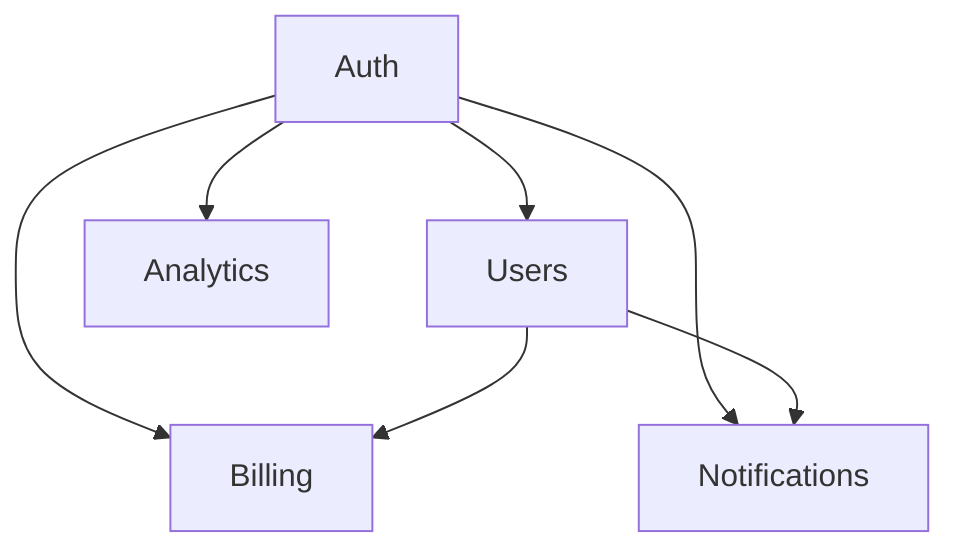

# Architecture

**Version**: 1.0.0  
**Last Updated**: 2026-02-13

## Overview

This document describes the high-level architecture of the application. It defines domain boundaries, layer structure, and dependency rules that are mechanically enforced.

## Domain Map

### Core Domains

**Auth** (`src/domains/auth/`)
- User authentication and authorization
- Session management
- Role-based access control
- Dependencies: None (foundational)

**Users** (`src/domains/users/`)
- User profile management
- User preferences and settings
- Account lifecycle
- Dependencies: Auth

**Billing** (`src/domains/billing/`)
- Payment processing
- Subscription management
- Invoice generation
- Dependencies: Auth, Users

**Analytics** (`src/domains/analytics/`)
- Event tracking
- Metrics aggregation
- Reporting and dashboards
- Dependencies: Auth

**Notifications** (`src/domains/notifications/`)
- Email notifications
- In-app notifications
- Push notifications
- Dependencies: Auth, Users

### Cross-Cutting Concerns

Located in `src/shared/`:
- **Telemetry**: OpenTelemetry instrumentation
- **Logging**: Structured logging utilities
- **Feature Flags**: LaunchDarkly integration
- **Database**: Database connection and migrations

## Layer Structure

Within each domain, code is organized into strict layers. Dependencies can only flow forward (left to right):

```
Types → Config → Repo → Service → Runtime → UI
```

### Layer Descriptions

**Types** (`types/`)
- Data type definitions
- DTOs, interfaces, enums
- Schema definitions (Zod)
- No business logic
- Dependencies: None

**Config** (`config/`)
- Configuration constants
- Environment variable parsing
- Feature flag definitions
- Dependencies: Types only

**Repo** (`repo/`)
- Data access layer
- Database queries
- External API clients
- Cache management
- Dependencies: Types, Config

**Service** (`service/`)
- Business logic
- Domain operations
- Validation and transformation
- Dependencies: Types, Config, Repo

**Runtime** (`runtime/`)
- Request handlers
- API route implementations
- Background job processors
- Dependencies: Types, Config, Repo, Service

**UI** (`ui/`)
- React components
- View logic
- Presentation layer
- Dependencies: Types, Config, Service, Runtime

### Providers Layer

Cross-cutting concerns enter through a special `Providers` layer:

```
Providers → Service → Runtime → UI
```

Providers include:
- Authentication context
- Database connections
- Telemetry context
- Feature flag client

## Dependency Rules

### Inter-Domain Dependencies



### Enforcement

1. **Structural Tests**: `tests/architecture.test.ts` validates dependency graph
2. **ESLint Rules**: Custom rules prevent cross-layer imports
3. **CI Checks**: Fails build on violations

## Package Structure

```
src/
├── domains/
│   ├── auth/
│   │   ├── types/
│   │   │   ├── user.types.ts
│   │   │   └── session.schema.ts
│   │   ├── config/
│   │   │   └── auth.config.ts
│   │   ├── repo/
│   │   │   └── user.repo.ts
│   │   ├── service/
│   │   │   ├── login.service.ts
│   │   │   └── register.service.ts
│   │   ├── runtime/
│   │   │   └── auth.routes.ts
│   │   └── ui/
│   │       └── LoginForm.tsx
│   ├── users/
│   │   └── [same structure]
│   └── ...
├── shared/
│   ├── telemetry/
│   ├── logging/
│   ├── feature-flags/
│   └── database/
└── utils/
    ├── validation/
    ├── formatting/
    └── crypto/
```

## File Size Limits

- Maximum file size: 500 lines (enforced by linter)
- Recommended: 200-300 lines per file
- If a file exceeds limit, split by:
  - Moving helpers to `utils/`
  - Extracting sub-services
  - Creating composition patterns

## Import Patterns

### ✅ Allowed

```typescript
// Service importing from Repo (same domain)
import { UserRepo } from '../repo/user.repo';

// Service importing from Types (same domain)
import { User } from '../types/user.types';

// Any layer importing from Shared
import { logger } from '@/shared/logging';

// Cross-domain imports at Type level
import type { UserId } from '@/domains/users/types';
```

### ❌ Not Allowed

```typescript
// UI importing from another domain
import { BillingService } from '@/domains/billing/service';

// Service importing from Runtime (backward dependency)
import { handler } from '../runtime/user.routes';

// Importing across domains at service level
import { BillingService } from '@/domains/billing/service';
```

## Evolution Guidelines

### Adding a New Domain

1. Create domain directory under `src/domains/`
2. Set up layer structure (types, config, repo, service, runtime, ui)
3. Update this document with domain description and dependencies
4. Add structural tests for the new domain
5. Update `docs/QUALITY_SCORE.md` with initial grade

### Modifying Domain Boundaries

1. Propose change in `docs/design-docs/`
2. Get team review on architectural impact
3. Create execution plan in `docs/exec-plans/active/`
4. Update this document
5. Update structural tests to match new boundaries

### Refactoring Layers

1. Ensure change maintains dependency flow
2. Update import paths
3. Run architectural lints: `npm run lint:architecture`
4. Run structural tests: `npm run test:architecture`
5. Update documentation

## Validation Commands

```bash
# Validate architecture
npm run lint:architecture

# Run structural tests
npm run test:architecture

# Visualize dependency graph
npm run arch:visualize

# Check for circular dependencies
npm run arch:circular
```

## References

- See `docs/DESIGN.md` for architectural patterns
- See `docs/QUALITY_SCORE.md` for quality expectations per layer
- See `docs/SECURITY.md` for boundary validation requirements
